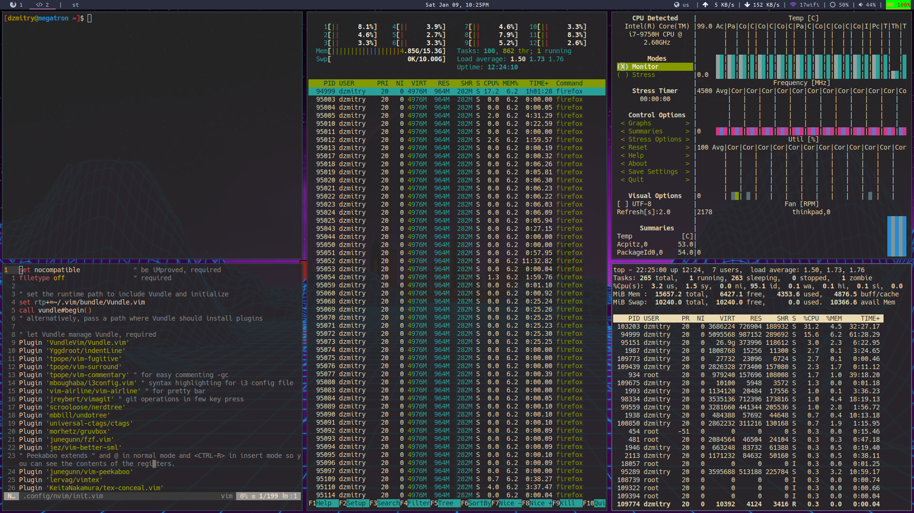

# my-dot-files
> Vim driven set up, the goal is to use the mouse as less as possible

## How this looks:


## Display manager (SDDM)


## Main info (get with neofetch)
```
                   -`                    dzmitry@megatron
                  .o+`                   ----------------
                 `ooo/                   OS: Arch Linux x86_64
                `+oooo:                  Host: 20QV0007US ThinkPad X1 Extreme 2nd
               `+oooooo:                 Kernel: 5.4.85-1-lts
               -+oooooo+:                Uptime: 18 hours, 53 mins
             `/:-:++oooo+:               Packages: 1536 (pacman)
            `/++++/+++++++:              Shell: zsh 5.8
           `/++++++++++++++:             Resolution: 1920x1080
          `/+++ooooooooooooo/`           DE: i3-with-shmlog
         ./ooosssso++osssssso+`          WM: i3
        .oossssso-````/ossssss+`         Theme: Arc-Dark [GTK2/3]
       -osssssso.      :ssssssso.        Icons: Papirus [GTK2], Papirus-Dark [GTK3]
      :osssssss/        osssso+++.       Terminal: st
     /ossssssss/        +ssssooo/-       Terminal Font: JoyPixels
   `/ossssso+/:-        -:/+osssso+-     CPU: Intel i7-9750H (12) @ 4.500GHz
  `+sso+:-`                 `.-/+oso:    GPU: NVIDIA GeForce GTX 1650 Mobile / Max-Q
 `++:.                           `-/+/   GPU: Intel UHD Graphics 630
 .`                                 `/   Memory: 3858MiB / 15657MiB

```

## General
**OS:** Arch Linux x86_64 LTS

**Window Manager:** i3-gaps

**Terminal:** st (based on Luke Smith's build), [custom build (basically, I just remapped some stuff)](https://github.com/funnydman/myst)

**Shell:** zsh 

**Reader:** zathura

**Display manager:** SDDM, [custom blade runner theme](https://github.com/funnydman/blade-runner-theme)

**Browser:** Firefox, plugins: 
 - tridactyl (like vimium but much better)
 - Privacy Badger
 - Joplin Web Clipper
 - Grammarly for Firefox
 - Awesome Emoji Picker
 - RESTer
 - uBlock Origin
 - Temp Mail - Disposable Temporary Email
 - Remove YouTube Recommended Videos, Comments
 - Simple Translate
 - Redux DevTools
 - React Developer Tools

**Notes Taking:** Joplin, highly recommend

**Editor:** neovim

**Bluetooth manager:** [Blueman manager](https://wiki.archlinux.org/index.php/Blueman) 
