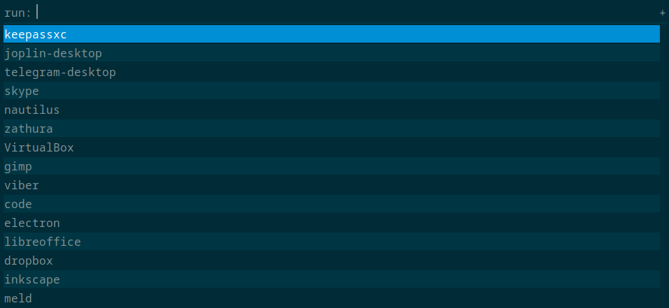

# my-dot-files
> Vim driven set up, the goal is to use the mouse as less as possible, based on vim, fzf, ripgrep usage.  


## How it looks:


## Display manager (SDDM)


## Rofi


## Main info (get with neofetch)
```
                   -`                    dzmitry@megatron
                  .o+`                   ----------------
                 `ooo/                   OS: Arch Linux x86_64
                `+oooo:                  Host: 20QV0007US ThinkPad X1 Extreme 2nd
               `+oooooo:                 Kernel: 5.15.61-1-lts
               -+oooooo+:                Uptime: 48 mins
             `/:-:++oooo+:               Packages: 1911 (pacman)
            `/++++/+++++++:              Shell: zsh 5.9
           `/++++++++++++++:             Resolution: 1920x1080
          `/+++ooooooooooooo/`           DE: i3-with-shmlog
         ./ooosssso++osssssso+`          WM: i3
        .oossssso-````/ossssss+`         Theme: Arc-Dark [GTK2/3]
       -osssssso.      :ssssssso.        Icons: Papirus [GTK2], Papirus-Dark [GTK3]
      :osssssss/        osssso+++.       Terminal: st
     /ossssssss/        +ssssooo/-       Terminal Font: JoyPixels
   `/ossssso+/:-        -:/+osssso+-     CPU: Intel i7-9750H (12) @ 4.500GHz
  `+sso+:-`                 `.-/+oso:    GPU: NVIDIA GeForce GTX 1650 Mobile / Max-Q
 `++:.                           `-/+/   GPU: Intel CoffeeLake-H GT2 [UHD Graphics 630]
 .`                                 `/   Memory: 6693MiB / 15643MiB
```


## General
**OS:** Arch Linux x86_64 LTS

**Window Manager:** i3-gaps

**Screen Locker**: i3lock-fancy

**Status Bar**: Polybar

**Terminal:** [myst](https://github.com/funnydman/myst) (based on Luke Smith's build | vim key bindings)

**Shell:** zsh 

**Dropdown Terminal:** guake

**File Manager:** ranger, nautilus 

**Package Manager:** yay

**Reader:** zathura

**Display Manager:** SDDM, [custom blade runner theme](https://github.com/funnydman/blade-runner-theme)

**Notification Daemon:** dunst 

**Browser:** Firefox (theme: Matte Black (blue)), plugins: 
 - tridactyl (like vimium but much better)
 - Privacy Badger
 - Joplin Web Clipper
 - Grammarly for Firefox
 - Awesome Emoji Picker
 - RESTer
 - uBlock Origin
 - Temp Mail - Disposable Temporary Email
 - Unhook YouTube (Remove YouTube Recommended Videos, Comments)
 - TempMail
 - Simple Translate
 - Redux DevTools
 - React Developer Tools
 - Youtube Watchmarker
 - Todoist: To-Do list and Task Manager
 - Tampermonkey

**Editor:** neovim ([gruvbox theme](https://www.google.com/search?client=firefox-b-d&q=gruvbox))

**Window switcher:** Rofi

## Additional 

**Password Manager:** keepass

**Screenshoter:** flameshot

**Notes Taking:** Joplin (highly recommend), Obsidian (for Zettelkasten)

**Image Viewer:** feh

**Media Player:** mpv

**Graphics Editor:** GIMP

**Bluetooth manager:** [Blueman manager](https://wiki.archlinux.org/index.php/Blueman) 


> ⭐️ Thanks everyone who has starred the project, it means a lot!

